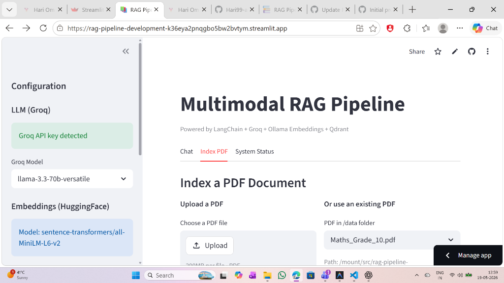
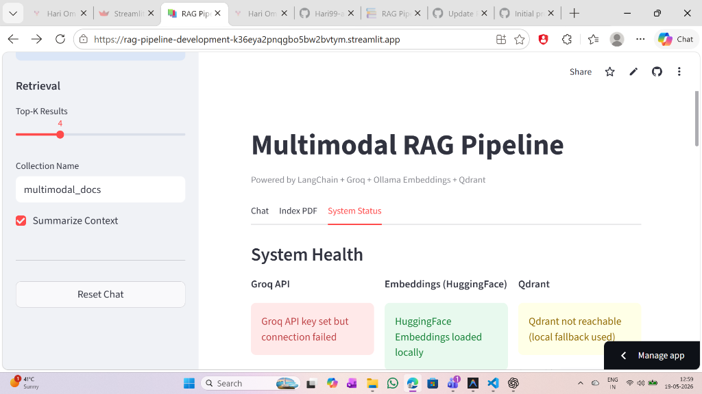

# 🧠 Multimodal RAG Pipeline for Educational Content

[](https://rag-pipeline-development-k36eya2pnqgbo5bw2bvtym.streamlit.app/)

A fully functional, modern **Retrieval-Augmented Generation (RAG)** pipeline designed to parse, index, query, and summarize multimodal PDF documents containing **text, mathematical formulas, and diagrams**. 

👉 **Live Demo:** [rag-pipeline-development-k36eya2pnqgbo5bw2bvtym.streamlit.app](https://rag-pipeline-development-k36eya2pnqgbo5bw2bvtym.streamlit.app/)

This repository supports both a standard **Command Line Interface (CLI)** and a premium **Streamlit Web Application** for interactive chat and document indexing.

---

## 📸 Web Application Interface

### 🔹 PDF Indexing Interface
Easily upload a PDF document, chunk it, embed it using HuggingFace serverless models, and store it in Qdrant or export it for offline local use.


### 🔹 System Health & Status
Monitor the status of your services in real-time, including Groq API connectivity, HuggingFace Embeddings, and Qdrant database status.


---

## 🚀 Objective

To build an interactive and robust **RAG system** capable of:
*   **Parsing & Indexing** complex educational PDFs (text + images/formulas) using PyMuPDF (`fitz`).
*   **Vector Embeddings** powered by HuggingFace `sentence-transformers/all-MiniLM-L6-v2` (384-dimensional space) for serverless local or cloud execution.
*   **Qdrant Vector Database** integration (with local in-memory fallback).
*   **LLM Inference** via the high-speed **Groq API** (e.g., Llama-3.3-70b, Llama-3.1-8b).
*   **Error-Resilient Fallback**: Gracefully displays the exact retrieved context/document chunks directly in the UI if the Groq API limits are exceeded or keys fail.

---

## 🧩 Tech Stack

| Component | Technology Used |
| :--- | :--- |
| **Programming Language** | Python 3.12 |
| **User Interface** | Streamlit |
| **Orchestration Framework** | LangChain |
| **LLM Provider** | Groq API (`ChatGroq`) |
| **Vector Store** | Qdrant (Cloud / Local Docker / In-Memory Fallback) |
| **PDF Parser** | PyMuPDF (`fitz`) |
| **Embeddings Model** | `sentence-transformers/all-MiniLM-L6-v2` (HuggingFace) |
| **In-Memory Retrieval** | scikit-learn `NearestNeighbors` (Cosine Similarity) |

---

## 📁 Repository Structure

```txt
RAG-Pipeline-Development/
│
├── assets/                  # Screenshot images for documentation
│   ├── index_pdf_tab.png
│   └── system_status_tab.png
│
├── data/                    # PDF data source directory
│
├── index/                   # Local vector index directory
│   ├── embeddings.npy       # Pre-computed NumPy matrix of vectors
│   └── docs.json            # Parsed document chunks and metadata
│
├── app.py                   # Main Streamlit web application
├── setup_pipeline.py        # Pipeline setup script (CLI)
├── rag_query.py             # RAG interactive querying engine (CLI)
├── generate_local_index.py  # Local index generator utility
├── requirements.txt         # Project dependencies
└── README.md                # Project documentation
```

---

## ⚙️ Installation & Setup

### 1️⃣ Clone the Repository
```bash
git clone https://github.com/Hari99-ai/RAG-Pipeline-Development.git
cd RAG-Pipeline-Development
```

### 2️⃣ Create and Activate a Virtual Environment
```bash
# Windows
python -m venv .venv
.venv\Scripts\activate

# Linux / MacOS
python -m venv .venv
source .venv/bin/activate
```

### 3️⃣ Install Dependencies
```bash
pip install -r requirements.txt
```

### 4️⃣ Configure Environment Variables
Create a `.env` file in the root directory:
```env
GROQ_API_KEY=your_groq_api_key_here
QDRANT_URL=http://localhost:6333
# If using Qdrant Cloud:
# QDRANT_API_KEY=your_qdrant_cloud_api_key
```

---

## 🧮 Running the Applications

### 💻 Option A: Interactive Streamlit Web App (Recommended)
Launch the beautiful UI to index your PDFs and chat in real-time:
```bash
python -m streamlit run app.py
```

### 💻 Option B: Command Line Interface (CLI)

#### 🔸 Step 1: Index a PDF Document
Index your document and upload to Qdrant or export as a local index:
```bash
python setup_pipeline.py --export_index
```

#### 🔸 Step 2: Query the RAG Pipeline
Ask questions about your documents via the terminal:
```bash
python rag_query.py --question "Explain the steps involved in solving a quadratic equation."
```

#### 🔸 Step 3: Context Summarization
Get an AI-generated summary of the relevant context before the answer:
```bash
python rag_query.py --summarize --question "What is Arithmetic Progression?"
```

---

## 🧩 Key Features

*   **Multimodal Parsing**: Extracts text blocks alongside embedded images and mathematical formulas.
*   **Offline/Online Flexibility**: Can connect to an external Docker Qdrant database or run purely offline via local in-memory cosine searches on a stored NumPy vector matrix.
*   **Serverless Embeddings**: Uses HuggingFace `sentence-transformers` for instant vector calculations, resolving local Ollama dependencies.
*   **Groq API Fallback**: Catches API rate limits or token exhaustion exceptions gracefully, showing the raw retrieved document text to the user.

---

## 🧑‍💻 Author

*   **Hari Om**
*   **Email**: [hariom993126@gmail.com](mailto:hariom993126@gmail.com)
